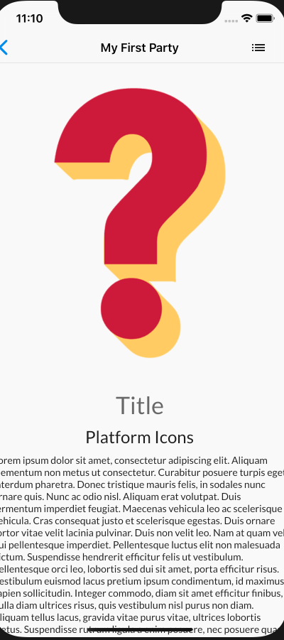

# MovieNight

To practice code and continue learning post grad, I'm teaching myself Flutter. I took a [mobile development course](https://github.com/n0ahth0mas/AIT_ANDROID) two semesters ago that focused on Android development with Kotlin, and I wanted to take this interest one step further with Flutter. I'll be updating this as I progress through the creation process.

## Contents

 - [Steps Towards Completion](#comp)
 - [App Overview](#overview)
 - [UI Sketches](#sketch)
 - [Flexible Model & API Integration](#flex)

<a name="comp">

## Steps towards app completion
</a>

 1. ~~Brainstorm features and goals~~ *completed 6/16*
 2. ~~Determine tools needed~~ *completed 6/16*
 3. ~~Sketch basic UI~~ *completed 6/16*
 4. ~~Develop hard coded model of app~~ *completed 6/17*
 5. ~~Add flexibility and actual, local functionality~~ *completed 6/19*
 6. Research and connect to a movie API (*in progress*)
 7. Add Firebase support
 8. Deploy?

<a name="overview">

## App Overview

</a>

I've found that my friends and I often want to watch a movie together but spend more time trying to figure out what to watch than watching it. To solve this, I decided to create an app that allows users to create their own watchlists and watch parties. While watchlists are for single users only, watch parties are groups of users. Once users in a watch party are ready, the party host can press a button to randomly select a movie from the unified watchlists of the party members. I plan on adding more selection modes than random, such as filtering and ranking based on amount of watchlists a movie is in. This app will also have data saved to Firebase in order to allow users make parties with multiple watchlists.

<a name="sketch">

## UI Sketches

</a>

In order to make a well designed app, it is important to properly sketch the UI and functionality before any coding is done. By developing the UI first, all time and energy spent while coding can focused on carrying out the sketches and list of functionality instead of designing them on the fly.

There were two phases of UI sketches. The first phase covers the overall structure and flow of the app.

| Login & Landing  | Party Page & Watchlist Variations |
| ------------- | ------------- |
|  | |

The second round of sketches were made to revamp the user's home page based on a number of apps I studied as well as Apple's [Human Interface Guidelines](https://developer.apple.com/design/human-interface-guidelines/), specifically taking out FABs and replacing them with menu-based buttons. As I continue to develop this application, I will be checking these guidelines and making changes based on them.

| Results & Details | Profile |
| ------------- | ------------- |
|  | |

<a name="flex">

## Flexible Model & API Integration

</a>

While very first version of this app followed the UI sketches, the second version adapted these sketches into a more user-friendly fashion. After creating a hard coded version of the application, I gave it a test run with real users. I took their notes into account, and, while connecting the app to the API, make structural changes to highlight watch parties through better visual representation.

| Home Screen | Party Details (needs complete overhaul) |
| ------------- | ------------- |
|  | |

| User Watchlist | Movie Details| Search|
| ------------- | ------------- |------------- |
|  | | |
